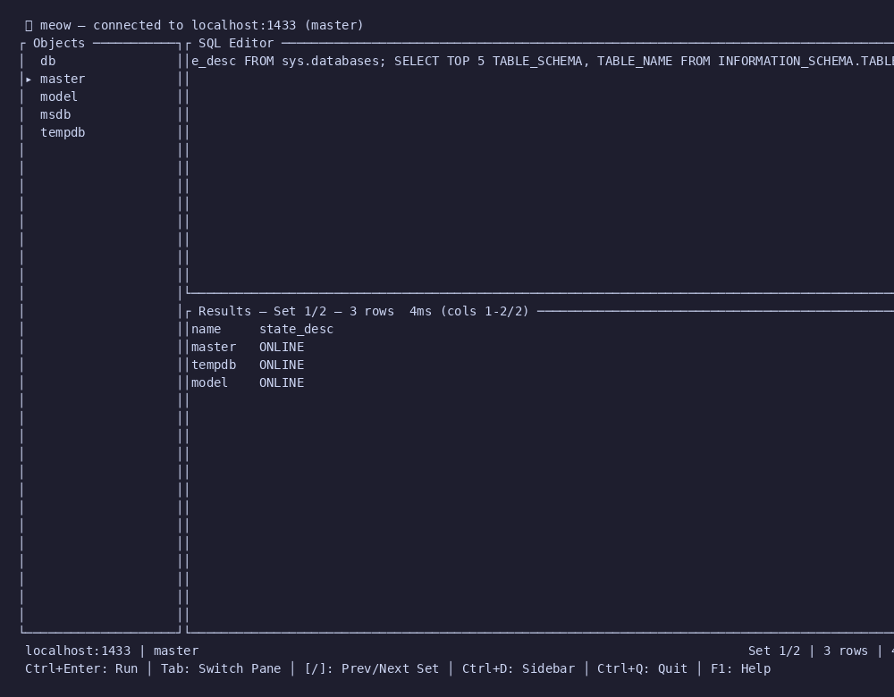

# 🐱 meow

A beautiful TUI client for Microsoft SQL Server, powered by [tabby](https://github.com/copycatdb/tabby).

> Think `pgcli` meets `lazygit` — fast, cross-platform, single binary.

Part of the [CopyCat](https://github.com/copycatdb) ecosystem.




## Installation

Build from source (requires Rust 1.85+):

```bash
git clone https://github.com/copycatdb/meow.git
cd meow
cargo build --release
# Binary at ./target/release/meow
```

## Usage

### TUI Mode (default)

```bash
meow -S localhost,1433 -U sa -P yourpassword --trust-cert
```

This launches the interactive TUI with three panes: object browser, SQL editor, and results.

### CLI Mode

```bash
# Interactive REPL
meow --cli -S localhost,1433 -U sa -P yourpassword --trust-cert

# Pipe a query
echo "SELECT 1 AS test" | meow -S localhost,1433 -U sa -P yourpassword --trust-cert

# Execute from file
meow -S localhost,1433 -U sa -P yourpassword --trust-cert -i query.sql

# Output as CSV
meow -S localhost,1433 -U sa -P yourpassword --trust-cert -i query.sql --format csv

# Output as JSON
echo "SELECT name FROM sys.databases" | meow -S localhost,1433 -U sa -P yourpassword --trust-cert --format json
```

## Options

| Flag | Description | Default |
|------|-------------|---------|
| `-S, --server` | Server address (`host,port`) | `localhost,1433` |
| `-U, --user` | SQL login username | — |
| `-P, --password` | SQL login password | — |
| `-d, --database` | Initial database | `master` |
| `--trust-cert` | Trust server certificate | off |
| `--cli` | Non-interactive CLI mode | off |
| `-i, --input` | Execute SQL from file | — |
| `-o, --output` | Write results to file | — |
| `--format` | Output format: `table`, `csv`, `json` | `table` |

## Slash Commands

Inspired by PostgreSQL's `psql`, meow supports backslash meta-commands for quick schema browsing and session control. Type `\?` for the full list.

```
\d              List all tables and views
\d <table>      Describe table columns
\dt / \dv       List tables / views
\di / \df       List indexes / functions
\x              Toggle expanded display
\conninfo       Show connection details
\c <db>         Switch database
```

📖 **[Full slash command reference →](docs/SLASH-COMMANDS.md)**

## Key Bindings

| Key | Action |
|-----|--------|
| `Ctrl+Enter` / `F5` | Execute query |
| `Tab` | Cycle focus: Editor → Results → Sidebar |
| `Ctrl+D` | Toggle sidebar (object browser) |
| `Ctrl+L` | Clear editor |
| `Ctrl+Q` | Quit |
| `F1` | Toggle help overlay |
| `↑/↓` | Scroll results (when focused) |
| `[` / `]` | Previous / next result set (when focused on results) |
| `Enter` | Expand/collapse sidebar node |

## Multi-Resultset Support

Queries that return multiple result sets (e.g. `SELECT 1; SELECT 2` or stored procedures) are fully supported. Each result set has its own columns and rows — use `[` and `]` to navigate between them when the results pane is focused.


## Architecture

```
src/
├── main.rs          — entry point, CLI args, mode dispatch
├── app.rs           — App state machine
├── commands.rs      — slash command parser and SQL generation
├── tui/
│   ├── mod.rs       — TUI setup/teardown, event loop
│   ├── ui.rs        — layout and rendering
│   ├── editor.rs    — SQL editor pane
│   ├── results.rs   — result grid/table pane
│   ├── sidebar.rs   — object browser
│   └── statusbar.rs — connection info, timing
├── db/
│   ├── mod.rs       — connection management
│   └── query.rs     — query execution, multi-resultset collection
└── cli/
    └── mod.rs       — non-interactive CLI mode
```

## License

MIT
