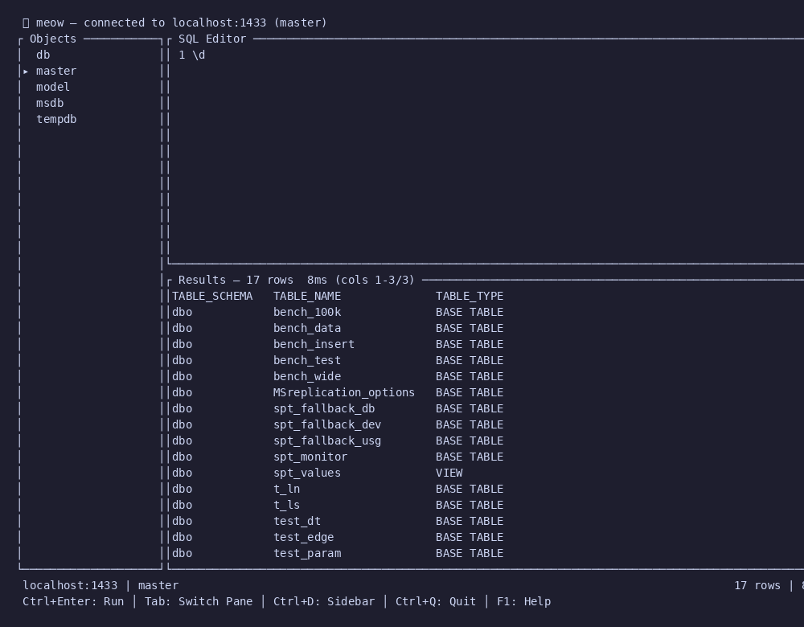
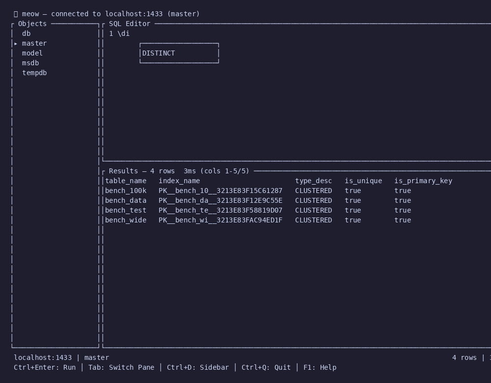
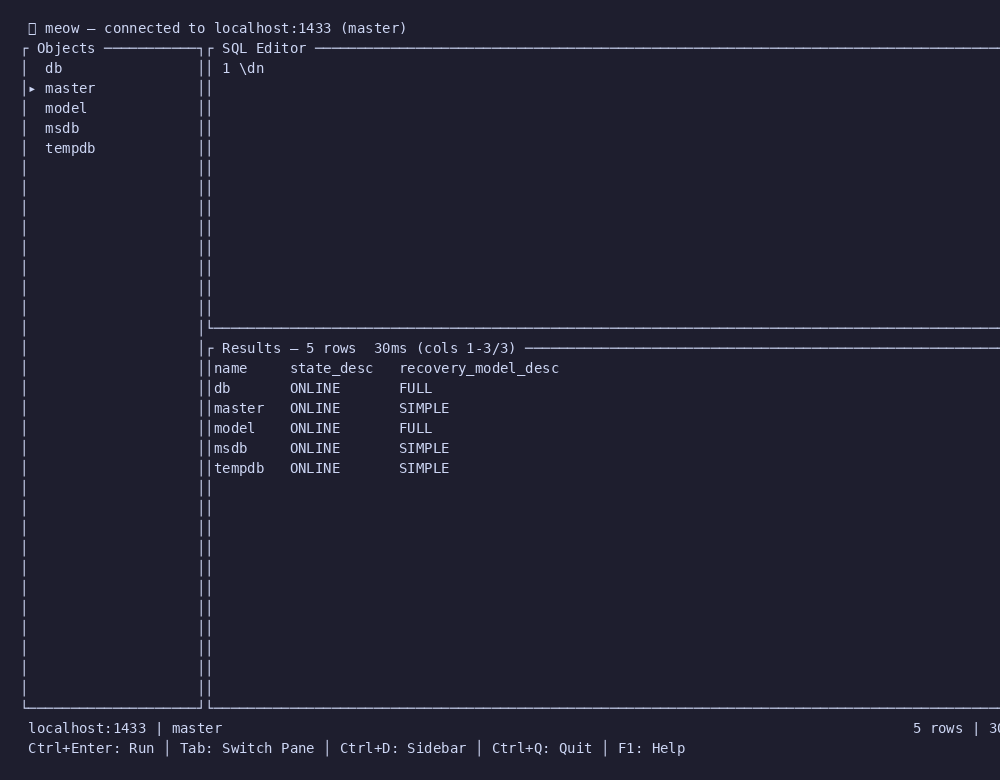
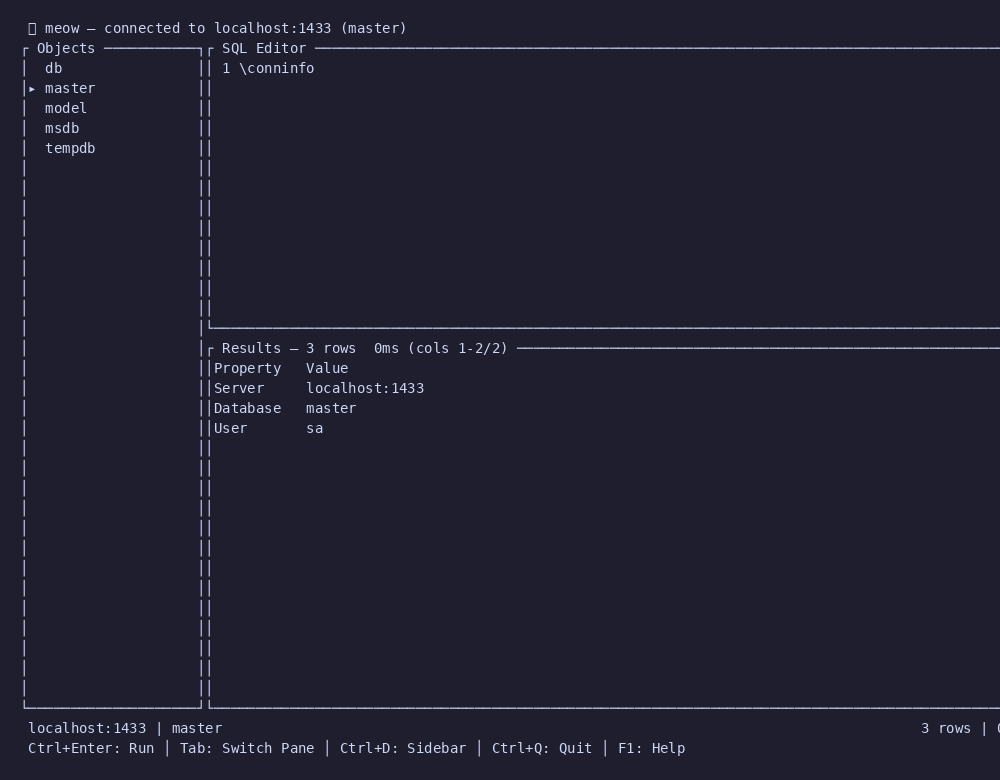
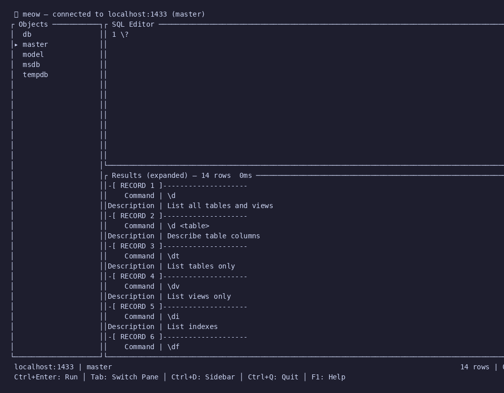

# Slash Commands

Inspired by PostgreSQL's `psql`, meow supports backslash meta-commands for quick schema exploration and session control — no need to remember `INFORMATION_SCHEMA` queries or `sys.*` views.

If you've used `psql`, you'll feel right at home. We mapped the most-used `\d` family and session commands to their SQL Server equivalents.

## Schema Commands

### `\d` — List all tables and views



### `\d <table>` — Describe table columns

Shows column name, data type, max length, nullability, and default value for a given table.

### `\dt` — List tables only

Same as `\d` but filtered to `BASE TABLE`.

### `\dv` — List views only

### `\di` — List indexes



Shows index name, type (clustered/nonclustered), uniqueness, and primary key status across all user tables.

### `\df` — List functions and stored procedures

### `\ds` — List schemas

### `\dn` — List databases



Shows all databases with their state and recovery model — handy for quick server reconnaissance.

## Connection Commands

### `\conninfo` — Show connection info



### `\c <database>` — Switch database

Executes `USE <database>` under the hood.

## Display Commands

### `\x` — Toggle expanded display

Switches between tabular and vertical record layout (like `psql`'s `\x`):

```
-[ RECORD 1 ]--------------------
    column1 | value1
    column2 | value2
-[ RECORD 2 ]--------------------
    column1 | value3
    column2 | value4
```

### `\timing` — Toggle query timing

### `\?` — Show help



Lists all available slash commands with descriptions, rendered in expanded display mode.

### `\q` — Quit

## Command Reference

| Command | Description | psql equivalent |
|---------|-------------|-----------------|
| `\d` | List all tables and views | `\dt` + `\dv` |
| `\d <table>` | Describe table columns | `\d <table>` |
| `\dt` | List tables only | `\dt` |
| `\dv` | List views only | `\dv` |
| `\di` | List indexes | `\di` |
| `\df` | List functions/procedures | `\df` |
| `\ds` | List schemas | `\dn` |
| `\dn` | List databases | `\l` |
| `\c <db>` | Switch database | `\c <db>` |
| `\conninfo` | Connection info | `\conninfo` |
| `\x` | Toggle expanded display | `\x` |
| `\timing` | Toggle timing | `\timing` |
| `\?` | Help | `\?` |
| `\q` | Quit | `\q` |

> **Note:** The mapping isn't 1:1 with psql — SQL Server's metadata model is different. `\ds` lists schemas (not sequences, which SQL Server doesn't have), and `\dn` lists databases (not schemas) since that's the more common "what's on this server?" question.
